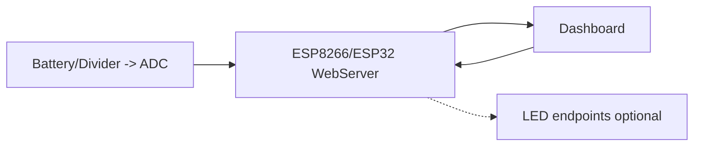

# ESP Web Server — Battery Dashboard & 25-Bay Charger

An ESP8266/ESP32 project that exposes battery telemetry via an on-device **web server**, renders a **real-time chart** in the browser (AJAX), and lets you **export CSV** for analysis.  
The repo also contains the **hardware for a 25-slot charging dock** with per-slot **CHARGE/FULL** LEDs.

Frontend lives in **`data/index.html`** (SPIFFS/LittleFS). The page polls `/battery` periodically and updates the chart; CSV can be downloaded from the same page or from a dedicated endpoint.

---

## Why it matters (OT/IoT)
- Classic **edge → UI** pattern: local telemetry, simple control, CSV export.
- Demonstrates **HTTP endpoints**, **AJAX polling**, ADC-based battery measurement, and a browser dashboard suitable for SCADA/MES-style views.

---

## Architecture



---

## Features
- On-device WebServer (firmware `.ino`).
- Real-time chart (AJAX + Highcharts) from **`data/index.html`**.
- Battery endpoints and optional LED control endpoints.
- CSV export from the UI or a dedicated `/export.csv` path.
- Runs entirely on LAN (no cloud dependency).

---

## Endpoints

| Method | Path           | Content-Type      | Purpose                                   |
|-------:|----------------|-------------------|-------------------------------------------|
| GET    | `/battery`     | `application/json` (or plain text) | Returns latest battery reading (`voltage`, `percent`). |
| GET    | `/export.csv`  | `text/csv`        | Streams `timestamp,voltage,percent` rows. |
| GET    | `/ledverde?...`, `/ledamarillo?...`, `/ledrojo?...`, `/ledblanco?...` | `text/plain` | Optional RGB controls. |
| GET    | `/ledfiesta?intensidadfiesta=…&delayfiesta=…` | `text/plain` | Optional “party” mode. |

The HTML polls `/battery` every ~1s and updates the chart.

---

## Repository layout (as used here)

```
/data                                  # SPIFFS/LittleFS content served by the ESP
  index.html
/Simulacion 3D                         # Schematics, PCBs, 3D previews
/Graficas bateria/Analis de las graficas
/Datasheets
/Documentos y proveedores
/Logos
/Pulseras PCB
ESP_Grafica_WebServer.ino              # main firmware (web server + endpoints)
Lectura_Bateria.ino                    # ADC helpers (voltage/percentage)
LICENSE                                # MIT
README.md
```

> Note the folder name for charts is **Analis de las graficas** (without the second “i”). Paths below use that exact spelling and URL-encoding for spaces.

---

## Hardware — Wearable board (ESP-12F)

- **MCU:** ESP-12F / ESP8266MOD (Wi‑Fi + ADC).  
- **Regulator:** AP2112K‑3.3 LDO (ESP powered from Li‑ion).  
- **RGB LEDs:** WS281x chain (e.g., WS2812/WS2813) on a single **Data** pin.  
- **Battery measurement:** resistor divider (e.g., **R7=402k / R8=100k**) with **C5=10µF** low-pass into **ADC**.  
- **Connector:** battery input + programming pads.

**Images**


.jpg)
.jpg)


**Full project (schematics, PCB, BoM) on EasyEDA / OSHWLab:**  
- Wearable bracelet: https://oshwlab.com/gabmax4/pulsera-final

---

## Hardware — 25‑Bay Charging Dock

A multi‑slot charger that can **charge up to 25 bracelets simultaneously**, each slot with two status LEDs:
- **CHARGE** (charging in progress)  
- **FULL** (fully charged)

From the schematic notations, the design matches a **single‑cell Li-ion charger of the TP4056 class** (CC/CV) with a **DW01A‑class protection IC** and a **dual MOSFET pack** (e.g., FS8205A). These parts are commonly paired; if your exact IC markings differ, replace the names here with the precise part numbers from your PCB.

**Images**


**Full project (schematics, PCB, BoM) on EasyEDA / OSHWLab:**  
- Charger dock: https://oshwlab.com/gabmax4/cargador_pulseras

---

## Battery telemetry — Results & analysis

Live chart examples captured during testing:


Related notes & PDF:
- Notes: `Graficas bateria/Analis de las graficas/Notas primera lectura sin grafica.txt`  
- PDF: `Graficas bateria/Analis de las graficas/lectura-bateria.pdf`

**Suggested metrics to report (fill in during a run)**
- Update latency (UI round-trip): `__ ms`  
- Dropped samples / packet loss: `__ %`  
- Voltage range & ADC scaling: `__ V` → `__ %`  
- CSV size: `__ rows` over `__ minutes`

---

## Build & upload

1. Configure Wi‑Fi in **`ESP_Grafica_WebServer.ino`**.  
2. Upload **SPIFFS/LittleFS** so **`data/index.html`** is available (Arduino/PlatformIO data upload tool).  
3. Flash the firmware.  
4. Open the device IP in a browser. The page polls **`/battery`** every ~1s and updates the chart.  
5. Download CSV from the page or via **`/export.csv`**.

---

## Security / production notes
- Add a **token/auth** if the device sits on a shared network.
- If hosting the dashboard off-device, restrict **CORS** to trusted origins.
- In OT networks, prefer network isolation/VLANs or VPN.

---

## License
Licensed under the **MIT License**. See [LICENSE](LICENSE).
